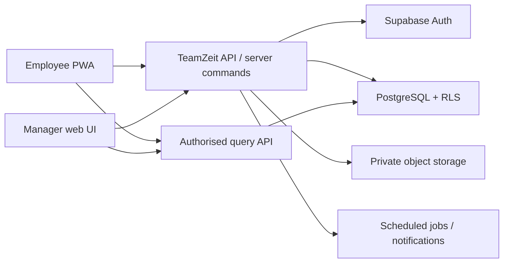

# TeamZeit Architecture

Status: proposed foundation for MVP development

Last updated: 2026-07-16

## 1. Purpose

TeamZeit is a multi-tenant workforce application for small and medium-sized organisations. The first product slice is trustworthy time tracking with employee self-service and manager approval. Absence management, scheduling, documents, and dashboards build on the same organisation and permission model.

The working product name is **TeamZeit**. Organisation names, logos, and themes are tenant data and must never be hard-coded into the application.

## 2. Architectural principles

1. **Tenant isolation first.** Every business record belongs to exactly one organisation (`organization_id`). Database Row Level Security (RLS) is the final isolation boundary.
2. **Server-authoritative time and permissions.** Clock events, approvals, month closing, audit entries, and privileged changes execute through server-side commands. The browser is not trusted.
3. **Append history; do not erase it.** Corrections and approvals preserve the original attendance record. Security-relevant operations create immutable audit events.
4. **Stable contracts between modules.** Modules communicate through IDs, shared types, and versioned API contracts, not by importing another module's implementation.
5. **One owner per concept.** Each table, API route, and shared type has one owning module.
6. **Mobile-first PWA, accessible desktop administration.** The employee flow must remain usable on a phone; manager views must also work on larger screens.
7. **Privacy by default.** Only the minimum absence information is exposed to colleagues. Sensitive documents are private and accessed with short-lived signed URLs.

## 3. System context



## 4. Recommended repository layout

```text
/
├─ ARCHITECTURE.md
├─ AGENTS.md
├─ docs/
│  ├─ MODULES.md
│  ├─ DATABASE.md
│  └─ AUTHORIZATION.md
├─ database/
│  └─ schema.sql
├─ contracts/
│  ├─ README.md
│  ├─ openapi.yaml
│  └─ src/
│     ├─ common.ts
│     ├─ identity.ts
│     ├─ time-tracking.ts
│     └─ index.ts
├─ apps/                 # future: employee and manager UI
├─ services/             # future: API / server commands
└─ tests/                # future: contract, RLS, integration, e2e
```

This foundation intentionally does not create application modules under `apps/` or `services/` yet.

## 5. Runtime architecture

### Client

- Installable responsive PWA.
- Uses Supabase Auth to obtain a user session.
- Calls versioned `/api/v1` endpoints with a bearer access token.
- May cache non-sensitive display data, but never decides permissions or final attendance totals.

### API / command layer

- Validates request bodies against the shared contract.
- Resolves the authenticated user and active organisation membership.
- Applies business rules and writes transactions atomically.
- Uses database/server time for clock events.
- Returns stable error codes defined by the API contract.

### Database

- PostgreSQL is the source of truth.
- All tenant-owned tables contain `organization_id`.
- RLS remains enabled even when access normally passes through the API.
- Cross-tenant foreign keys include or verify `organization_id`.

### Object storage

- Private buckets only for employee documents and absence attachments.
- Object paths begin with organisation and owner IDs.
- Downloads use short-lived signed URLs after an authorisation check.

## 6. Data and time rules

- Persist instants as `timestamptz` in UTC.
- Persist calendar dates as `date` in the organisation's local calendar.
- Each organisation owns an IANA time zone, initially `Europe/Berlin`.
- Durations are integer minutes; money, if introduced later, uses integer minor units.
- API timestamps use ISO 8601 UTC strings.
- A work session may cross midnight. Its `work_date` is assigned in the organisation time zone according to the start instant.
- Calculated balances are derived from approved/source records. Cached summaries must be reproducible.

## 7. Consistency and transactions

The following operations are atomic server-side transactions:

- clock in, start/end break, and clock out;
- submit/approve/reject a correction;
- submit/approve/reject an absence request;
- close or reopen a month;
- invite or deactivate a member;
- change a role or manager scope.

Mutating endpoints accept `Idempotency-Key`. Duplicate retries return the original logical result. Optimistic concurrency uses `version` on editable aggregate roots.

## 8. Security boundaries

- Authentication proves identity; an active organisation membership grants tenant access.
- A user can belong to multiple organisations and selects one active organisation per request.
- Roles grant broad capability; manager scopes restrict it to assigned locations/teams.
- Service-role credentials never reach the browser.
- The Supabase publishable/anon key may be public, but RLS and API validation must assume it is known to attackers.
- Audit events are insert-only for application users.

Detailed rules are in [docs/AUTHORIZATION.md](docs/AUTHORIZATION.md).

## 9. API strategy

- Base path: `/api/v1`.
- JSON request and response bodies.
- Resource reads plus explicit command endpoints for state transitions.
- Cursor pagination for lists that may grow; month views may use bounded date ranges.
- Error envelope: `{ error: { code, message, field?, requestId } }`.
- The normative HTTP contract is [contracts/openapi.yaml](contracts/openapi.yaml).
- TypeScript DTOs in `contracts/src` are the source used by TypeScript clients; CI should later verify that they remain compatible with OpenAPI.

## 10. Module dependency rule

Allowed dependency direction:

```text
feature UI -> shared contracts <- feature API
feature API -> its domain/repository -> database
```

A feature must not import another feature's repository, UI state, or private types. Cross-feature actions use an application service or a documented domain event. Shared contracts must contain no UI framework or database client types.

## 11. Testing gates for future work

Every feature change should include, proportionate to risk:

- unit tests for calculations and state transitions;
- API contract tests;
- database/RLS tests for employee, manager, admin, inactive member, and foreign tenant;
- integration tests for transactional commands;
- critical mobile and manager end-to-end flows;
- accessibility checks for interactive UI.

No module is complete when it only works with RLS disabled or service-role access.

## 12. Key decisions and deferred decisions

Accepted for the foundation:

- multi-tenant from the first migration;
- Supabase Auth/PostgreSQL/Storage;
- REST/JSON API with explicit commands;
- immutable correction and audit history;
- organisation-configured local time zone.

Deferred until implementation planning:

- frontend framework and monorepo tooling;
- API runtime (Supabase Edge Functions versus a dedicated service);
- notification provider;
- payroll export formats;
- exact retention periods and works-council requirements;
- offline clocking policy (default recommendation: no authoritative offline clock events).
