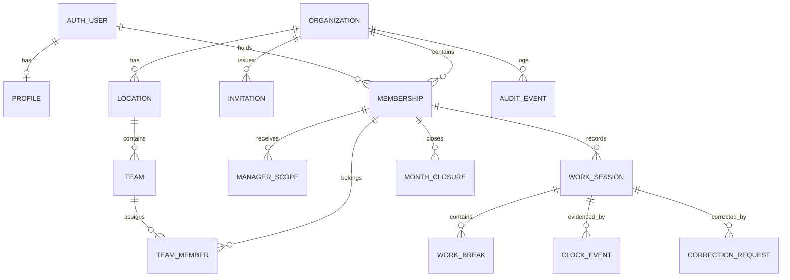

# Database model

`database/schema.sql` is the executable reference model. It must be split into ordered migrations before the first shared environment is deployed.

## Core relationships

## Ownership rules

- `profiles` is global identity display data and is keyed by the Auth user ID.
- `memberships` connects a user to an organisation and carries their role and employment settings.
- All operational data is tenant-owned through `organization_id`.
- Composite foreign keys ensure a child and parent belong to the same organisation.
- Invitations store only a hash of the bearer token. Raw invitation tokens must not be persisted.

## Attendance model

- `work_sessions` stores non-overlapping work intervals. Break totals are derived from gaps between intervals.
- `work_breaks` is retained only for legacy history and receives no new records.
- `clock_events` is append-only evidence of live user actions and supports idempotent retries through `request_id`.
- `correction_requests` is retained as legacy history; direct interval changes are immediate and write audit events.
- Partial unique indexes allow only one open work session per member and one open break per session.
- `month_closures` records closing and explicit reopening instead of deleting the close record.

## Invariants enforced outside simple constraints

The command transaction and its database function/tests must enforce:

- no overlapping work sessions for the same membership;
- clock state transitions occur in the correct order;
- `work_date` matches the organisation-local date rule;
- mutations are rejected for closed periods;
- manager access is limited to effective team/location scope.

## Deletion and retention

- Organisations and operational records are not hard-deleted through product APIs.
- Employees and structure records are deactivated/archived.
- Audit and clock evidence are append-only.
- Exact retention and deletion schedules are a policy decision to complete before production; they must account for German employment, tax/payroll, and privacy requirements.
